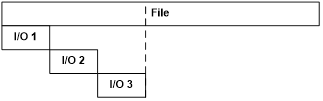

The following sections explain how you can use the DiskSpd parameters to customize tests so that they more closely emulate the performance factors that your environment requires.

## Set a test duration
The default measured test duration is 10 seconds. This can be changed with the `-d` parameter, for example `-d50` will result in a ~50 second long test. The actual measured test duration may be slightly longer than the requested time because of additional thread synchronization and precision of the operating system's sleep methods. The actual duration of the test is reported as part of the results.

A warm up time may also be specified, during which the specified I/O requests are being issued but no measurements are performed. The default warm up duration is 5 seconds and can be changed using the `-W` parameter (for example, `-W10` sets a 10-second warm up).

A cool-down period can be specified using the `-C` parameter; for example, `-C5` adds a 5 second cool-down period. The default cool-down time is 0 seconds. A use case for cool-down is to ensure that, especially in multi-system tests, all instances of DiskSpd are active during each instance's measurement period. Specify a cool-down which is at least as long as the time taken to launch the DiskSpd instances on the systems providing the test.

## Control caching
To control software (operating system) and hardware caching, use the `-S` parameter. There are five modifiers that can be applied:
* `<none>`: `-S` in isolation is equivalent to `-Su` (see below)
* `b`: enables software caching; this is the default
* `h`: disables software caching and sets write-through I/O
* `u`: disables software caching
* `r`: disables local caching (relevant to remote file systems only)
* `w`: enables write-through I/O

The default of buffered I/O is equivalent to stating `-Sb` explicitly.

Disabling the software cache introduces additional constraints:
* File access must begin at byte offsets within the file that are integer multiples of the volume's sector size.
* File access must be for numbers of bytes that are integer multiples of the volume's sector size. For example, if the sector size is 512 bytes, an application can request reads and writes of 512, 1024, or 2048 bytes, but not of 335, 981, or 7171 bytes.

The `-S` or `-Su` parameter is equivalent to using the FILE_FLAG_NO_BUFFERING flag with the Windows [CreateFile](https://msdn.microsoft.com/en-us/library/windows/desktop/aa363858(v=vs.85).aspx) function.

The `-Sh` parameter disables both software caching and hardware write-caching and has the same constraints that apply to disabling software caching. It is equivalent to using both the FILE_FLAG_NO_BUFFERING and FILE_FLAG_WRITE_THROUGH flags with the Windows CreateFile function. The combination of `-Suw` is equivalent.

Write-through may be independently specified with `-Sw`. Stated in isolation, this the same as explicitly using `-Sbw` for cached write-through.

SATA HDDs will generally not honor write through intent on individual I/Os. Devices with persistent write caches – certain enterprise flash drives and most storage arrays – will complete write-through writes when the write is stable in cache. In both cases, `-S`/`-Su` and `-Sh`/`-Suw` will see equivalent behavior. In general and barring bugs, when write-through affects write I/O performance it indicates that normal writes are not in stable caches and data may be lost during hardware or power-down events.

The `-Sr` parameter is specific to running tests over remote file systems such as SMB and disables the local cache while leaving the remote system's cache enabled. This can be useful when investigating the remote file system's wire transport performance and behavior, allowing a wire-limited read test to occur without needing extremely fast storage subsystems. This can be combined with `w` (`-Srw`) to specify write-through on the server.

## Set random or sequential access hints
The `–f<rst>` parameters result in the random-access, sequential-only and/or temporary file hints being indicated to the operating system when opening the targets.

These hints are generally applicable only to files and only if software caching is enabled for the test. They are equivalent to using the following flags with the Windows CreateFile function:
* `r`: FILE_FLAG_RANDOM_ACCESS
* `s`: FILE_FLAG_SEQUENTIAL_SCAN
* `t`: FILE_ATTRIBUTE_TEMPORARY

Please see the operating system documentation for the [CreateFile](https://msdn.microsoft.com/en-us/library/windows/desktop/aa363858(v=vs.85).aspx) function for the behavioral definitions of these options. Note that the random access and sequential-only hints indicate access patterns which are exclusive of the other and combining them may result in unusual behavior.

The temporary file attribute only takes effect if the file is newly created (see [Create test files automatically](Customizing-tests#create-test-files-automatically)) and has the effect of delaying background cache writes until memory pressure requires progress or the file is closed. In conventional use, this allows a spill file to be created on the assumption that it will be quickly deleted, avoiding all writes. This may be useful in focused performance tests for similar reasons.

## Block Size
The block size used for I/O operations is set with the `-b` parameter. The default value is 64KiB.

## Test random I/O
The `-r` parameter turns on random I/O access. The file offset at which the I/O operation will be performed is chosen randomly before each I/O operation. All offsets are aligned to the size specified with the `-r` parameter.

If you use the `-r` parameter without specifying the size, offsets are block-aligned. The block size is set with the `-b` parameter.

This parameter can't be used with the `-s` parameter, because `-s` defines the offset for the next I/O operation and in case of random I/O the offset of the next operation is not a constant value. If both `-r` and `-s` are specified, `-r` overrides `-s`.

## Test sequential I/O
The `-s` sequential I/O parameter specifies the stride from the prior I/O to the next operation. For example, if a 64KiB stride is chosen for a 4KiB block size, the first I/O will be at zero, the second at 64KiB and so forth.

After the whole file is read, I/O resumes at the base offset (`-B`) or zero, as appropriate.

If multiple threads operate on a single target, the threads will operate independently and the target will see multiple sequential streams. This is most useful with sequential stride (`-T`, see [Access from multiple threads & thread stride](Customizing-tests#access-from-multiple-threads--thread-stride)).

If the optional interlocked (`i`) qualifier is used, `-si`, a single interlocked offset is shared between all threads operating on a given target. This mode is most useful when a single sequential pattern is desired and a single thread is unable to fully drive very fast storage.

## Perform a write test
Use the `-w` parameter to specify the mix of I/O operations, as a percentage of write requests to issue in increments of 1%. The default is 0% write, or 100% read.

The following are equivalent and result in a 100% read-only workload: omitting `-w`, specifying `-w` with no percentage and `-w0`.

As example of a mixed load `-w10` will result in a 10% write workload, with the remaining 90% being reads. This is implemented as a random choice at the dispatch of each operation. DiskSpd does not track the resulting mix and instead relies on the long-term behavior of the random number generator to deliver the expected ratio.

**CAUTION**: A write test will destroy existing data without issuing a warning.

## Set a base target offset
To omit the beginning of a target during testing, use the `-B` parameter to specify a base target offset. The default offset is zero. No I/O operations will be performed between the start of the target and the base offset.
* random operations (`-r`) are issued at base + \<random offset>
* sequential operations (`-s`) wrap back to the base offset when they pass the end of the target

For example, the following command runs a 10 second test on physical drive 1 with a block size of 8KiB and skips the first 10 blocks (80KiB):

`diskspd -b8K -B10b #1`

## Set the maximum target offset
The maximum offset in the target to be tested can be specified with the `-f` parameter. If specified, DiskSpd will not access beyond that point in the file, partition, or disk. This option is especially useful for testing first sectors of physical drives. In combination with `-B` (see Set a base target offset) the total range of the target to be tested can be controlled.

## Limit the total number of threads
One thread can run a test against more than one target (file, physical drive, partition). The total number of threads can be set with the `-F` (fixed threads) parameter. For example, the following command uses two threads, each accessing five files:

`diskspd -F2 -o2 file1 file2 file3 file4 file5`

In this example, `-F2` causes only two threads to be created. Each thread will access all of the files, with two outstanding operations per target (-o2). As a result, there are 5 x 2 = 10 outstanding operations per thread and 2 x 10 = 20 total operations.

By contrast, the `-t` (per-target threads) parameter creates sets of threads which only access a specific target.

`diskspd -t2 -o2 file1 file2 file3 file4 file5`

In this example, the `-t2` parameter causes two threads per target to be started, for 5 x 2 = 10 total threads with two outstanding operations each. Again, this would produce 2 x 10 = 20 total operations.

The `-O` parameter can be used to specify the number of outstanding operations per fixed thread rather than per target. For example, the following command uses two threads, each accessing five files with a total of four requests outstanding per thread:

`diskspd -F2 -O4 file1 file2 file3 file4 file5`

In this example before each operation is issued a file to target will be randomly chosen.

The `-F` parameter is especially useful for balancing the workload on multiprocessor (or multi-core) systems. You can set `-F` to the number of processors in the system. By default, the threads are affinitized in a Round Robin manner, which distributes processing evenly across the CPUs, enabling you to test more devices simultaneously before you hit a CPU bottleneck.

The `-F` and `-t` parameters are mutually exclusive. Figure 1 and Figure 2 illustrate the differences between `-t` and `-F`.


Figure 1. Threads specified with the `-F` (`-F3`) fixed threads parameter


Figure 2. Threads specified with the `-t` (`-t3`) per-target threads parameter

## Access from multiple threads & thread stride
By default, a target is accessed by only one thread although that thread can contain more than one overlapped I/O operation.

With the `-t` or `-F` parameters discussed in the previous section, multiple threads will access the same file. By default, threads performing sequential operations will all start from offset 0 (zero) of the target. Use the `-T` parameter to specify the offset between threads (thread stride) if necessary.

Figure 3 shows an example of access with a stride creating an interleaved pattern between multiple threads. Thread 1 accesses blocks 1, 4 and 7 of the file. Thread 2 accesses blocks 2, 5 and 8 and thread 3 accesses blocks 3, 6 and 9.

To get such a pattern, thread stride (`-T`) must be equal to block size (`-b`) and sequential stride size (`-s`) must equal the number of threads (in this case 3) times the block size. This is a case where specifying strides in units of blocks can be more concise. Either of the following commands will produce that pattern:

`diskspd -t3 -T4k -b4k -s12k C:\testfile`

or

`diskspd -t3 -T1b -b4K -s3b c:\testfile`


Figure 3. Accessing the file from multiple threads

All the used parameters are also explained in Figure 4.


Figure 4. Parameters: base file offset (B), block size (b), stride size (s) and offset between threads (T)

In the previous example, while the pattern is suggestive, there is no interlock between the threads to maintain a strictly sequential pattern of access to the storage (see further discussion in [Test sequential I/O](Customizing-tests#test-sequential-io) earlier). It is possible due to thread scheduling that the pattern could separate over time, with one or more threads falling behind or racing ahead of their peers.

A second use case for thread stride is to create multiple spatially separated sequential streams on a target:

`diskspd -c3G -t3 -T1G -b4K -s c:\testfile`

This pattern will create a 3GiB file and three threads, with each thread starting I/O at succeeding 1GiB intervals.
* Thread 1: 0, 4KiB, 8KiB, …
* Thread 2: 1GiB, 1GiB+4KiB, 1GiB+8KiB, …
* Thread 3: 2GiB, 2GiB+4KiB, 2GiB+8KiB, …

Thread stride need not be a multiple of sequential strides (or vice versa). When the end of file is encountered, access wraps back to the beginning at an offset such that each thread will reproduce the same I/O offsets on its next sweep through the target. In the earlier examples each thread will loop back to 0 (zero). Consider the following counter-example:

`diskspd -c3G -t3 -T13k -b4K -s c:\testfile`

In this case, the second thread will loop back to offset 1K and then produce 5K, 9K, before returning to 13K and continuing through the file again.

## Number of outstanding I/O requests
The default number of outstanding I/O requests per thread per target is two. This value can be changed with the `-o` parameter; for example, `-o32` specifies 32 I/O requests per thread per target. If `-o1` is used and threads are accessing only one target (`-F` is not used or there is only one target specified or `-O1` is used), I/O is issued synchronously.

At the time the test starts, each thread issues its initial batch of I/O up to the limit created by `-o` (or`-O`). Then, by default, as completion for one I/O operation is received another is issued to replace it in the queue.

For sequential I/O, by default the new operation will be issued with respect to the most recent I/O operation started within the same thread. Figure 5 shows an example of this behavior with three outstanding I/Os per thread (`-o3`) and a sequential stride equal to the block size (`-s`). The next I/O operation will start at the offset immediately after I/O #3, which is marked with a dashed line.



Figure 5. Overlapped I/O (`-o3`)

The sequential I/O process can be explained with the following pseudo-code. Each thread has its own `lastFileOffset` variable.

```
UINT64 GetNextOffset()
{
    lastFileOffset += stride;
    return lastFileOffset;
}
```

This behavior changes with the `-p` parameter for parallel overlapping I/Os. When used, the offset of the next I/O operation is calculated by using the offset of the I/O operation that has just finished instead of the most recent I/O operation that started. Figure 6 shows how the `-p` parameter changes the behavior with three I/Os per thread (`-o3`) and a sequential stride equal to the block size (`-s`).


Figure 6. I/O dispatch pattern of the `-p` parameter (at `-o3`)

In the figure above, the primed I/Os (marked with prime symbols) indicate the sequence of completion and dispatch, for example that I/O 2'' was issued on the completion of I/O 2'. At the time the diagram stops the three outstanding I/Os are 1', 2'' and 3.

With `-p`, the next sequential offset is calculated in the manner shown in the following pseudo-code, assuming there is enough data left in the file:
```
UINT64 GetNextOffset(struct IO *completedIO)
{
    return completedIO->startOffset + stride;
}
```

The `-p` option creates a very specific pattern perhaps most suitable for cache stress and its effect should be carefully considered before use in a test.

## Balance queues
I/O requests started by each thread are placed in a separate queue. DiskSpd assures that the queues will be balanced, which means that an I/O operation is restarted as soon as it completes. By default queue refilling is implemented using I/O completion ports. As discussed previously (see [Limit the total number of threads](Customizing-tests#limit-the-total-number-of-threads)), DiskSpd creates one thread for each target (file, physical drive, or partition) by default.

Each thread opens a separate I/O completion port and uses it to wait until one of the overlapped (outstanding) I/O operations finishes. The operation that finished is restarted (at a new offset). The thread behavior is shown in the following pseudo-code:
```
SetThreadIdealProcessor
AffinitizeThread
CreateIOCompletionPort
WaitForASignalToStart
for (int x = 0; x < overlappedIONumber; ++x)
{
    io = ReadFile
}

while (bRun)
{
    GetQueuedCompletionStatus // Wait on I/O completion port
    CalculateNextOffset
    RestartIOOperation
}
```
I/O completion ports have a small overhead and therefore are convenient to use in I/O performance measurements.

In the case of synchronous access (`-o1`), DiskSpd uses a different approach. Because only one I/O operation is running at any time, the use of I/O completion ports is not needed. Instead, I/O operations are executed in a loop, as demonstrated by the following pseudo-code:
```
SetThreadIdealProcessor
AffinitizeThread
CreateIOCompletionPort
WaitForASignalToStart

while (bRun)
{
    ReadFile
    CalculateNextOffset
}
```

In both cases, the `bRun` global variable is used by the main thread to inform the worker threads how long they should work. The main thread of the I/O request generator works in the following manner:
```
OpenFiles
CreateThreads
StartTimer
SendStartSignal
Sleep(duration)
bRun = false
StopTimer
WaitForThreadsToCleanUp
SendResultsToResultParser
```

## Alternatively, specify “think” time and I/O bursts
An exception to purely balanced queue operations is a specification of I/O dispatch scheduling in terms of per-thread per-target “think” time and I/O burst size. This can be specified with the combination of `-i` and` -j` parameters.
* `-i<count>`: number of I/Os to issue per burst
* `-j<milliseconds>`: number of milliseconds to pause between bursts

Ensure that there is sufficient outstanding I/O allowed (`-o`) to achieve the intended bursts. Storage latency may prevent the system from achieving the rates theoretically specified with these parameters.

## Rate limits
A more advanced exception to balanced queue operation can be specified with the `-g` parameter, which specifies a target number of bytes to operate on per-millisecond per-thread per-target.

The following example targets 80 bytes/millisecond * 1000 milliseconds/second = 80,000 bytes/second, or equivalently 80,000 bytes/second / 8KiB/IO = ~9.8 IOPs.

`diskspd -t1 -o1 -s8k -b8k -Sh -w100 -g80 c:\test1`

By adding a second file, the following example doubles the total I/O target to 160,000 bytes/second, or ~19.5 IOPs.

`diskspd -t1 -o1 -s8k -b8k -Sh -w100 -g80 c:\test1 c:\test2`

Adding a second thread doubles the total I/O target again to 320,000 bytes/second, or ~39.1 IOPs.

`diskspd -t2 -o1 -s8k -b8k -Sh -w100 -g80 c:\test1 c:\test2`

The precision of rate limits can be affected by thread scheduling, total CPU consumption, instantaneous storage latency and other factors. Longer total test times will generally converge on the requested rate limits. If rate limits aren't reached, consider providing additional outstanding I/Os (`-o`) to threads, dividing work across adding additional threads (`-t` or `-F`) or, as appropriate to test goals, adding targets.

In general, effective use of rate limits may require some experimentation.

## Use completion routines instead of I/O completion ports
As stated earlier, DiskSpd by default uses I/O completion ports to refill outstanding operation queues. However, completion routines can also be used. The `-x` parameter instructs DiskSpd to use I/O completion routines instead of I/O completion ports.

When using completion routines, the next I/O is dispatched from the completion routine as opposed to returning to a single, master loop as with I/O completion ports.

## Set CPU affinity
Thread migration can produce inconsistent results during performance testing. For that reason, DiskSpd by default affinitizes all of its threads to CPU cores in a Round Robin manner starting at logical CPU 0 in Processor Group 0, assigning one thread per CPU in that group and so forth for each subsequent Processor Group in the system. If there are more threads than logical CPUs, assignment returns to CPU 0 in Processor Group 0 and the process repeats until all threads are assigned.

This default behavior is the same as `-ag` in prior versions of DiskSpd and can still be explicitly specified as `-ag`. In prior versions, the default affinity only used the logical CPUs in the Processor Group which DiskSpd started in. This could have led to inconsistent results in multiple Processor Group systems as successive runs of DiskSpd could have been in different Processor Groups, leading to uncontrolled Non-Uniform Memory Access (NUMA) effects.

This default affinity can be turned off by the `-n` parameter.

Advanced CPU affinity can be turned on by using the `-ag#,#[,#,…]` parameter which specifies a Processor Group number followed by the CPU numbers separated by commas (for example, `-ag1,2,0,3,1`). Threads will be affinitized to the specified CPUs in a Round Robin manner until all threads are assigned.
* multiple `-ag#` specifications can be made on the same command line; they accumulate in the order specified.
* multiple `g#,#[,#,…]` specifications can be made within the same switch; the following are equivalent:
  * `-ag0,0,1,2,g1,0,1,2`
  *	`-ag0,0,1,2 -ag1,0,1,2`
* the number of CPUs can differ from the number of threads.
* a CPU can be stated more than once.

Threads cannot be assigned to inactive processors. They will be skipped under `-ag` and if one is assigned via `-ag#`, an error will be returned.

The processor group topology of the system and active/inactive processor mask is provided in the `<System>` element of the XML output results.

## Create test files automatically
Use the `-c` parameter to indicate that the target files to be used in testing should be created (or recreated) with the specified size. There is no default size.

For example, the following command creates two 100 MiB files, c:\test1 and d:\test2 and runs a 20 second read test on both files:

`diskspd -c100M -d20 c:\test1 d:\test2`

When creating files, DiskSpd ensures that the valid data length as tracked by the file system is the same as the size of the file prior to starting test operations. If possible, an optimized fast path is taken using the Windows [SetFileValidData](https://msdn.microsoft.com/en-us/library/windows/desktop/aa365544(v=vs.85).aspx) function. However, if the test is run in a security context which does not have access to the SeManageVolumePrivilege privilege that the function requires, the file must be written through once prior to test operations which may take significant time for large files. See the Windows SetFileValidData function reference for more information. Administrative contexts generally have access to this privilege.

DiskSpd will display a warning if the slow path is taken:
```
WARNING: Could not set privileges for setting valid file size; will use a slower method of preparing the file
```

IMPORTANT: The optimized fast path for extending valid data length may expose previously written but logically deleted content from the storage subsystem. Ensure that if this path is used, either:

* test files are not accessible by unauthorized users
* the storage subsystem provides protection for previously deleted data

## Separate buffers for read and write operations
Each thread allocates a separate buffer for read I/O operations and write I/O operations. The reason for having one buffer per thread instead of having one buffer for all of the threads is to speed up processing in NUMA systems. Threads should use memory from the node on which they are running because that is faster than accessing memory from a different node. Separate buffers should also increase the chances of cache locality.

## Specifying write entropy
Separate buffers are used for reads and writes so that read operations won't overwrite the write buffer contents.  The write buffer is initialized with a repeating byte pattern of 0x00, 0x01, 0x02, … 0xFF, 0x00, 0x01, 0x02 and so forth. The `-Z` parameter instead causes these buffers to be zeroed at the start of the test.

In many modern storage systems, data is compressed and/or de-duplicated in-line or near-line to the I/O path. The extent to which data can be compressed or de-duplicated can have strong effects on storage performance. Therefore, some control on the entropy (randomness) of data is useful to both test whether a storage system is performing such actions, in comparing performance with highly compressible and incompressible data, or in choosing a data pattern which may be appropriate for a given workload simulation such as a sample database.

The `-Zr` option causes the write buffer to be filled with random content immediately before issuing an I/O. This has a run-time cost but provides the most randomness in the data written (no duplicate blocks of bytes).

The `-Z<size>[K|M|G|b]` option instead causes dedicated per-target write source buffers of the specified size to be allocated. Write content is selected from these buffers at random on a 4-byte alignment. This allows for many distinct block-sized patterns to be chosen from a small source buffer. For instance, an 8KiB write source buffer used for a 4KiB block test provides (8KiB - 4KiB) / 4 = 1024 potentially unique blocks.

By default, write source buffers will be filled with random data. With the `-Z<size>[K|M|G|b],<file>` option, a sample file can be provided whose initial contents (from byte zero) is used initialize the write source buffers. If the file is smaller than the desired buffer size, its content is repeated into the buffer until they are filled. Each write source buffer filled with random data will be distinct, but each filled from a sample file will have the same content.

The options here are useful when testing different scenarios:
1. If the storage stack doesn't support compression/dedup: Don't specify `-Z` at all.
2. If the storage stack supports compression:
   * If you don't want the data to be compressible: Use `-Z<size>`.
   * If you want the data to be partially compressible: Use `-Z<size>,<file>` with a source file that contains appropriately compressible content.
   * If you want the data to be fully compressible: Use `-Z`.
3. If the storage stack supports dedup:
   * If you don't want the content to be dedupable: Use `-Zr`.
   * If you want the content to be partially dedupable: Use `-Z<size>` where size is chosen such that 512 / (\<size> - I/O size) * 100 is the percent of content that should be duplicated.
   * If you want the content to be fully dedupable: Use `-Z`.

## Support for large pages
In certain cases, it may be useful to use large-page support for I/O buffers. This is specified using the `-l` parameter, which requires the user to have access to the SeLockMemoryPrivilege privilege.

By default, DiskSpd allocates buffers as follows:
```
VirtualAlloc(…, MEM_COMMIT, PAGE_READWRITE)
```

The `-l` parameter instead does:
```
VirtualAlloc(…, MEM_COMMIT | MEM_RESERVE | MEM_LARGE_PAGES, PAGE_EXECUTE_READWRITE)
```

## Including Event Tracing for Windows (ETW) statistics
DiskSpd can display data concerning events from an NT Kernel Logger trace session. Because event tracing carries additional overhead, it's turned off by default. You can use the following parameters to turn on event tracing for one or more groups of kernel events:
* `-eDISK_IO`:  Trace physical disk I/O events.
* `-ePROCESS`:  Trace process start and end events.
* `-eTHREAD`:  Trace thread start and thread end events.
* `-eIMAGE_LOAD`:  Trace image loads.
* `-eMEMORY_PAGE_FAULTS`:  Trace all memory page faults.
* `-eMEMORY_HARD_FAULTS`:  Trace only hard page faults.
* `-eNETWORK`:  Trace TCP/IP and UDP/IP send and receive events.
* `-eREGISTRY`:  Trace registry calls.

By default, DiskSpd instructs the NT Kernel Logger to use non-paged memory for event tracing. If you want the NT Kernel Logger to use paged memory, include the `-ep` parameter.

Furthermore, ETW data will be time stamped using the high-resolution Query Performance Counter timer. This can be adjusted as follows:
* `-eq`: Query Performance Counter [default]
* `-ec`: CPU cycle counter
* `-es`: System time

The following command instructs DiskSpd to display trace data for physical disk I/O events and registry events:

`diskspd -eDISK_IO -eREGISTRY testfile.dat`

The test will return data similar to the following:
```
ETW:
----

        Disk I/O
                Read: 128
                Write: 28
        Registry
                NtCreateKey: 1
                NtDeleteKey: 0
                NtDeleteValueKey: 0
                NtEnumerateKey: 0
                NtEnumerateValueKey: 0
                NtFlushKey: 0
                NtOpenKey: 222
                NtQueryKey: 118
                NtQueryMultipleValueKey: 0
                NtQueryValueKey: 229
                NtSetInformationKey: 0
                NtSetValueKey: 0


          ETW Buffer Settings & Statistics
--------------------------------------------------------
(KB)                           Buffers   (Secs)   (Mins)
Size  | Min |  Max  |  Free  | Written  | Flush    Age
138       4     26     7        225         0       15

Allocated Buffers:      7
Lost Events:            0
Lost Log Buffers:       0
Lost Real Time Buffers: 203
```

## Display a progress indicator
A progress indicator can be helpful, especially for long-running tests and debugging purposes. By default, no progress indicator is displayed as it can affect performance. If you want to see one, use the `-P` parameter to specify the number of completed I/O operations after which DiskSpd will print a dot as a progress indicator. For example, `-P10000` adds a dot after every 10,000 completed I/O operations. The number of completed I/O operations is calculated independently by each thread.

## Control the initial state of the random number generator
Use the `-z[seed]` parameter to control the initial state of the random number generator. By default, a seed value of zero is used. If the parameter is specified without an explicit seed the value of the Windows [GetTickCount](https://msdn.microsoft.com/en-us/library/windows/desktop/ms724408%28v=vs.85%29.aspx) function is used, which is a high-resolution counter based on the current system uptime.

Note that the total behavior of a multi-threaded test also depends on thread scheduling effects, so the random number generator is not a complete control on test behavior.

## Run DiskSpd in verbose mode
Use the `-v` parameter to run DiskSpd in verbose mode. In verbose mode, DiskSpd returns the following information about its actions:
* When a worker thread is created
* When start and end signals are sent to worker threads
* The offset of the next I/O operation (along with the worker thread number and I/O number)
* Start and stop time for each NT Kernel Logger session

## Use named events to synchronize testing
DiskSpd can synchronize on named events that the user provides. If any event that is specified using these parameters (`-ys`, `-yf`, `-yr`, or `-yp`) does not exist, DiskSpd creates a notification event.
* If the `-yr` parameter is specified (for example, `-yrMyStartEvent`), DiskSpd initializes itself but does not start the test (not even the warm up phase) until the specified event is set.
* Similarly, you can specify a custom stop event with the `-yp` parameter (for example, `-ypMyStopEvent`). By default, a test run ends when the specified test time elapses or the user presses Ctrl+C to cancel the test. With the `-yr` parameter, the test run ends and results are displayed, when the stop event occurs. Moreover, if the stop event is provided, Ctrl+C becomes associated with the stop event, enabling you to stop all DiskSpd instances waiting on the same object at the same time by pressing CTRL+C in one of them.
* The events can be set by any external tool or by running DiskSpd with the parameter `-ye` (for example, `-yeMyStartEvent`). You can specify multiple instances of the `-ye` parameter if needed.
* There are also two more events that, if provided by the user, send a notification when the actual test begins and ends. An event provided with `-ys` (for example, `-ysMyTestStartedEvent`) is signaled right before the measurements start; an event provided with `-yf` (for example, `-yfMyTestFinishedEvent`) sends a notification right after measurements are completed.

## Use an XML file to provide DiskSpd parameters
Parameters controlling a test can be passed to DiskSpd as part of the command line or as an XML profile.

Using command line parameters (e.g. `-w, -b8k`, etc.) is easy for simple, homogenous tests. The limitation though, is that parameters passed on the command line apply to all targets and threads; for instance, using a different block size for different targets is not possible when command line parameters are used. Specifying the configuration of a test in an XML profile does not have this limitation. Each target is treated separately and thus can be accessed using different block sizes, offsets, strides, flags and so forth.

XML run profiles are provided using the `-X<path>` option, where `<path>` is a path to an XML file compliant with the diskspd.xsd schema. The `-X` parameter is not compatible with any other parameter and thus has to be used alone (i.e. `diskspd -Xprofile.xml`). The [diskspd.xsd](https://github.com/Microsoft/diskspd/blob/master/XmlProfileParser/diskspd.xsd) file is embedded within the diskspd.exe file.

## Creating an XML profile file
The XML result output (see `-Rxml`) contains a subsection describing the test which can be used to repeat a given test or as a base for more complex test descriptions. This is the `<Profile>…</Profile>` section. Copy this section to a file, modify as needed and provide it to the `-X<path>` parameter.

## Specify multiple time spans in the XML profile
On top of the per-target set of parameters, using an XML-based test configuration allows for specifying multiple time spans. Each time span, `<Timespan>…</Timespan>` is treated as a separate test with its own duration, set of targets and so forth. This can be useful when a workload that changes over time is needed.

## Canceling a test run
You can cancel a DiskSpd run at time by pressing CTRL+C. DiskSpd exits gracefully and displays all of the data it collected before the cancellation as long as the warm-up period has completed.
